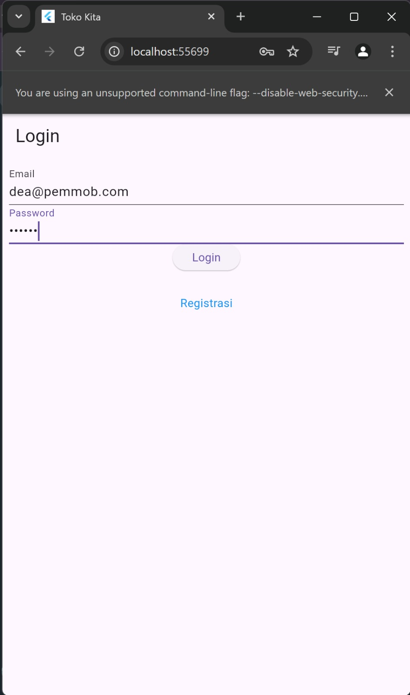
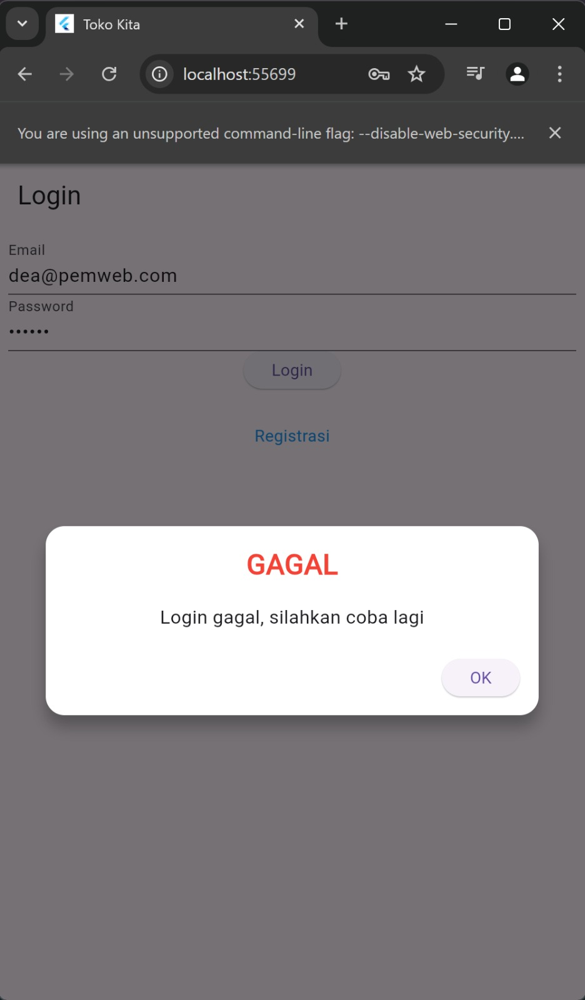
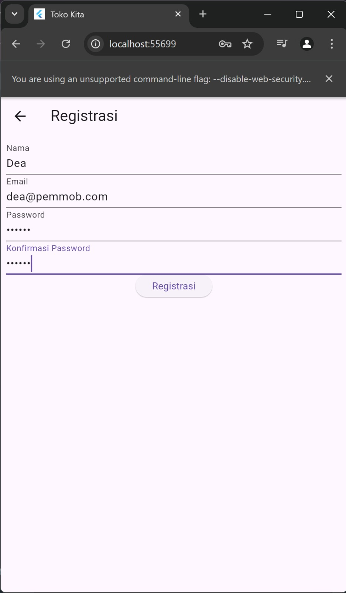
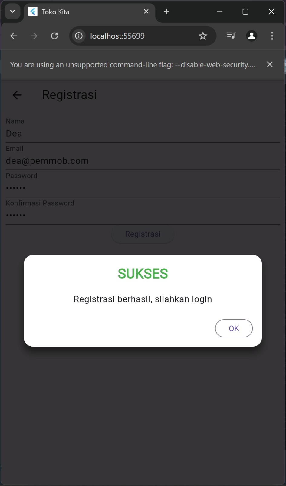
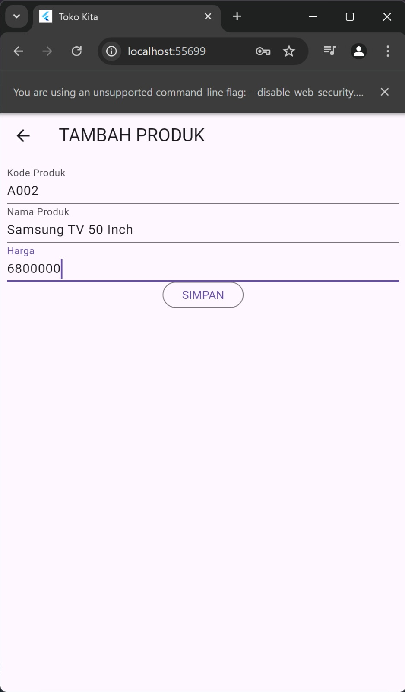
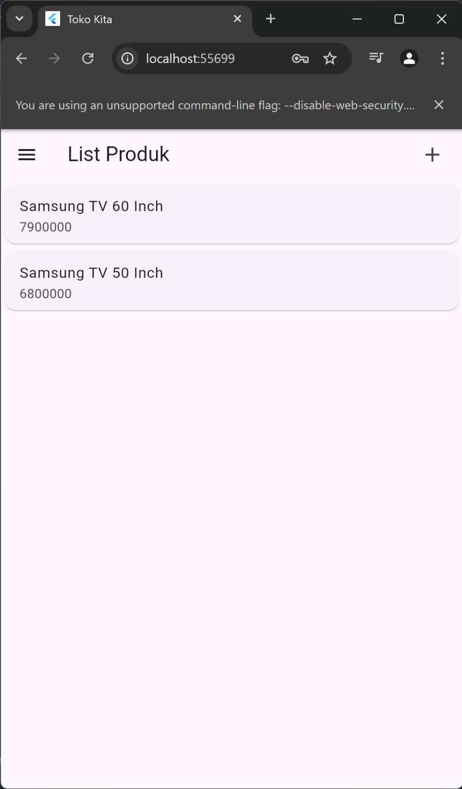
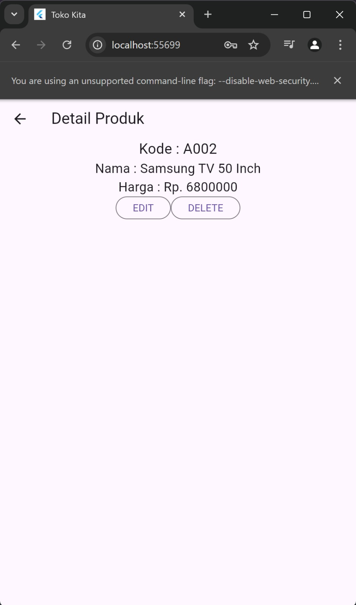
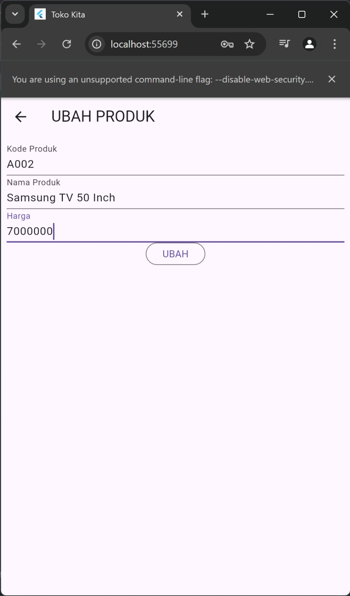
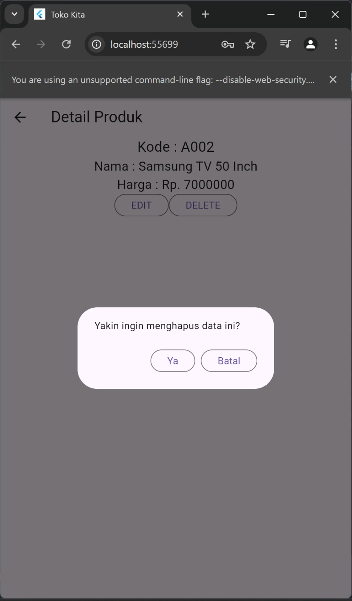
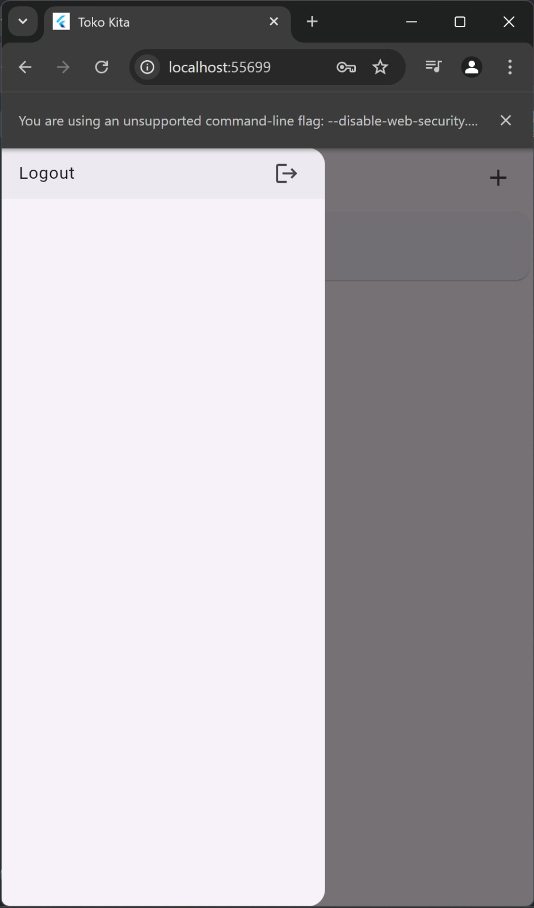

Nama : Dea Afni Azizah

NIM : H1D022093

Shift Baru: C

## PENJELASAN
1. Login
   a. Tampilan Login
      
      1) Pengguna mengisi field email dan password.
      2) Data yang dimasukkan akan divalidasi untuk memastikan bahwa semua field diisi.
      3) Data login dikirim ke server melalui API menggunakan metode POST.
      4) Di server, endpoint /login memeriksa keberadaan email di database dan memverifikasi password. Jika berhasil, server menghasilkan token otorisasi.
      5) Server mengirimkan respon berupa token dan data pengguna:
      6) Token disimpan di perangkat pengguna menggunakan shared_preferences untuk autentikasi di sesi mendatang.
   b. Pop-up
      1) Jika login berhasil, pengguna akan diarahkan ke halaman produk. Jika gagal, akan muncul pop-up.
         
      2) Berikut adalah kodenya:
         void _submit() {
        _formKey.currentState!.save();
        setState(() {
          _isLoading = true;
        });
        LoginBloc.login(email: _emailTextboxController.text, password: _passwordTextboxController.text)
          .then((value) async {
            if (value.code == 200) {
              await UserInfo().setToken(value.token.toString());
              await UserInfo().setUserID(int.parse(value.userID.toString()));
              Navigator.pushReplacement(context, MaterialPageRoute(builder: (context) => const ProdukPage()));
            } else {
              _showWarningDialog("Login gagal, silahkan coba lagi");
            }
          }).catchError((error) {
            _showWarningDialog("Login gagal, silahkan coba lagi");
          }).whenComplete(() {
            setState(() {
              _isLoading = false;
            });
          });
      }

2. Registrasi
   
   a. Pengguna memasukkan data seperti nama, email, dan password ke dalam formulir registrasi.
   b. Data yang dimasukkan akan divalidasi. Misalnya, nama harus minimal 3 karakter, email harus valid, dan password harus minimal 6 karakter.
   c. Setelah validasi berhasil, data dikirim ke server melalui API menggunakan metode POST.
   d. Di server, endpoint /registrasi akan menerima data dan menyimpannya ke dalam database setelah melakukan hashing pada password.
   e. Pop-up akan muncul ketika registrasi sukses
      
   f. Berikut kodenya:
      Widget _buttonRegistrasi() {
        return ElevatedButton(
          child: const Text("Registrasi"),
          onPressed: () {
            var validate = _formKey.currentState!.validate();
            if (validate) {
              if (!_isLoading) _submit();
            }
          });
      }
   
3. Tambah Produk
   a. Tampilan Tambah Produk
      
      1) Pengguna memasukkan informasi produk yang mencakup kode, nama, dan harga.
      2) Data produk dikirim ke server dengan metode POST ke endpoint /produk menggunakan format JSON.
      3) Server menyimpan produk ke database dan mengembalikan data produk yang baru dibuat beserta status.
   b. Kode
      void simpan() {
        setState(() {
          _isLoading = true;
        });
        Produk createProduk = Produk();
        createProduk.kodeProduk = _kodeProdukTextboxController.text;
        createProduk.namaProduk = _namaProdukTextboxController.text;
        createProduk.hargaProduk = int.parse(_hargaProdukTextboxController.text);
      ProdukBloc.addProduk(produk: createProduk).then((value) {
          Navigator.of(context).push(MaterialPageRoute(builder: (context) => const ProdukPage()));
        }).catchError((error) {
          _showWarningDialog("Simpan gagal, silahkan coba lagi");
        }).whenComplete(() {
          setState(() {
            _isLoading = false;
          });
        });
      }

4. Tampil Produk
   a. Tampilan Tampil Produk
      
      1) Pengguna mengakses endpoint /produk dengan metode GET untuk mendapatkan semua produk.
      2) Server mengambil semua data produk dari database.
      3) Server mengembalikan daftar produk dalam format JSON.
   b. Kode
      @override
      Widget build(BuildContext context) {
        return FutureBuilder<List<Produk>>(
          future: ProdukBloc.getProduks(),
          builder: (context, snapshot) {
            if (snapshot.hasData) {
              return ListView.builder(
                itemCount: snapshot.data!.length,
                itemBuilder: (context, index) {
                  return ItemProduk(produk: snapshot.data![index]);
                },
              );
            } else {
              return const Center(child: CircularProgressIndicator());
            }
          },
        );
      }
   c. Detail Produk
      
      1) Pengguna mengklik produk dari daftar produk yang ditampilkan.
      2) Setelah produk dipilih, aplikasi mengirim permintaan GET ke server menggunakan endpoint /produk/{id}, di mana {id} adalah ID produk yang ingin dilihat detailnya.
      3) Di server, endpoint ini akan mengambil informasi lengkap tentang produk dari database berdasarkan ID yang diberikan.
      4) Server mengembalikan detail produk dalam format JSON

5. Ubah Produk
   a. Tampilah Ubah Produk
      
      1) Pengguna mengisi formulir dengan data yang diperbarui untuk produk tertentu.
      2) Data yang diperbarui dikirim ke server dengan metode PUT ke endpoint /produk/{id}.
      3) Server memperbarui data produk di database dan mengembalikan status.
   b. Kode
      void deleteProduk(int id) {
        ProdukBloc.deleteProduk(id: id).then((value) {
          if (value) {
            _showSuccessDialog("Produk berhasil dihapus");
          }
        }).catchError((error) {
          _showWarningDialog("Hapus produk gagal");
        });
      }

6. Hapus Produk
   a. Tampilan Hapus Produk
      
      1) Pengguna memilih produk dan mengonfirmasi penghapusan.
      2) Permintaan hapus dikirim ke server dengan metode DELETE ke endpoint /produk/{id}.
      3) Server menghapus produk dari database dan mengembalikan status.
   b. Kode
      void deleteProduk(int id) {
        ProdukBloc.deleteProduk(id: id).then((value) {
          if (value) {
            _showSuccessDialog("Produk berhasil dihapus");
          }
        }).catchError((error) {
          _showWarningDialog("Hapus produk gagal");
        });
      }

7. Logout
   a. Tampilan Logout
      
      1) Pengguna menekan tombol logout pada sidemenu.
      2) Menghapus token yang disimpan agar pengguna harus login ulang.
   b. Kode
      1) Logout
         await LogoutBloc.logout().then((value) {
           Navigator.of(context).pushAndRemoveUntil(MaterialPageRoute(builder: (context) => LoginPage()), (route) => false);
         });
      2) logout_bloc.dart
         class LogoutBloc {
           static Future logout() async {
             await UserInfo().logout(); // Menghapus token dari SharedPreferences
           }
         }
